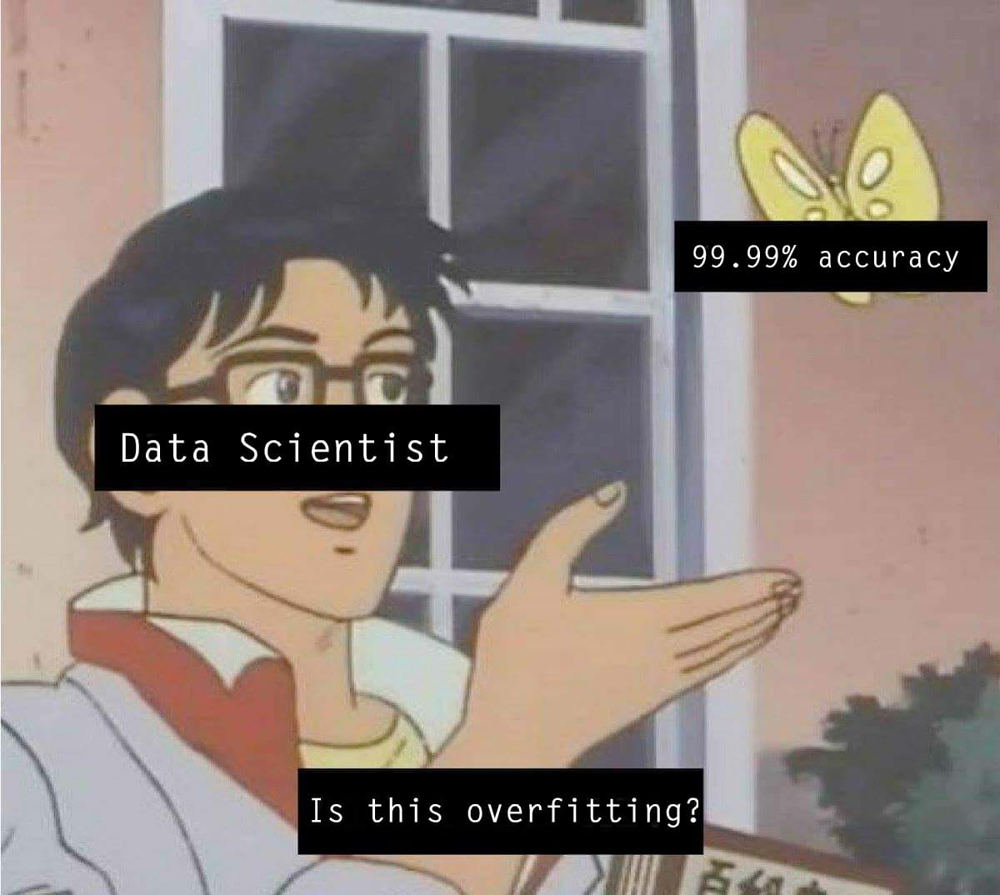

 

<h2><b>🛠️ Tech Stack</b></h2>

- 🎓 CS Student | passionate about **Artificial Intelligence**
- 🤖 Currently diving deep into **Machine Learning**
- 🏆 Aspiring to be a top **Data Scientist**
- 📫 How to reach me: **Kareemukhattab@gmail.com**
<!-- - 🎮 When I'm not training models, I'm gaming -->

<h2><b>📬 Contact Me</b></h2>

---

<!-- ###  Me looking at my train accuracy vs test accuracy -->

<!-- Upload the meme image to this repo and replace 'meme.jpg' with the actual filename -->
